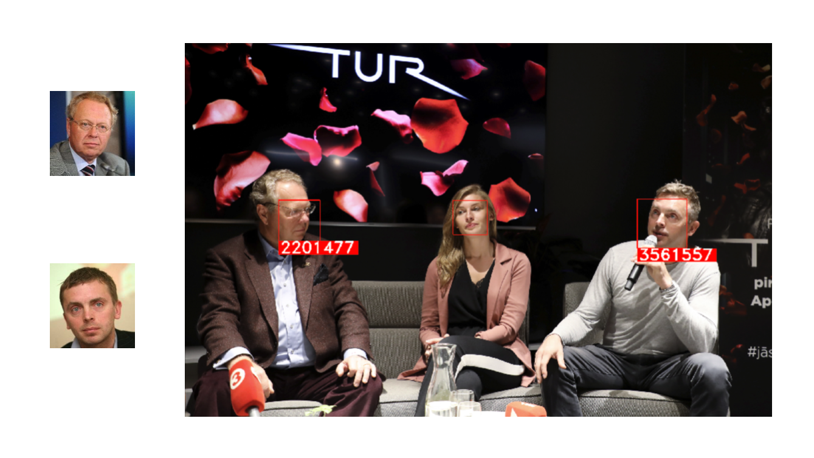

# DL4media_captioning

##Image Captioning

Learns from COCO style datasets (particular model trained on LECO – a combination of COCO with the captions translated to latvian and a similar amount of picture-caption pairs taken from the LETA database) of pictures and captions.

**Provides latvian captions to new images. Logs messages to project's demo version of DL Lifecycle Data Management tool.**

Based on TensorFlow Authors work on Image Captioning with Attention.

**To run** download the image-captioning.ipynb notebook. Enter paths to a COCO style annotation file and folder of corresponding images in field under "Download and prepare the MS-COCO dataset" (these will need to be downloaded to your computer and placed in folders you can reference). Similarly add the path to your testing set of images in field under "Try it on your own images".

##Facial Recognition

Accepts image-name pairs of people and finds and names them in other images. Also finds other new faces in the images, assigns new IDs to them and keeps track of those (with the goal being that a human editor can afterwards tell the program what ID belongs to what person). Presents the most often seen faces that the program doesn't know the name of yet.

This program is part of the Image Captioning project with the intention to ultimately be merged into one.

Made using face\_recognition (https://github.com/ageitgey/face\_recognition) library.

> A slide from face-rec-showcase.pdf, showing a profile picture that was passed with an ID, and that face afterwards found in another picture. For more examples like these see face-rec-showcase.pdf

**To run** download the face-rec.ipynb notebook. Provide paths to folder of pictures of people you know ("PATH_KNOWN"),  and the test set folder ("PATH_TEST"). The program can afterwards create save files to remember the learned faces, that can be loaded in subsequent runs.